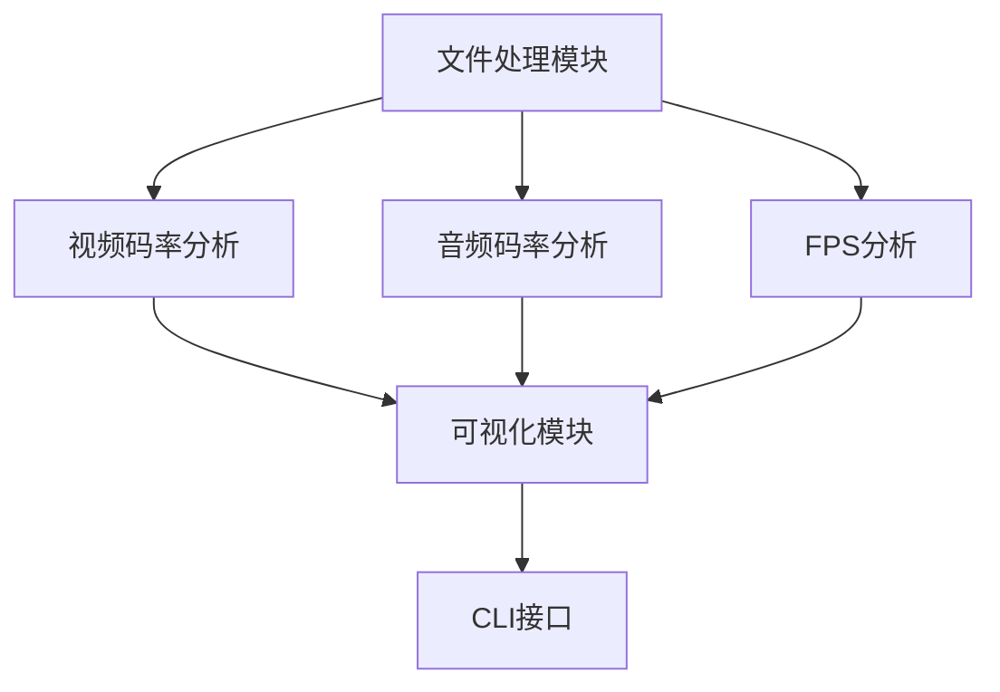

# 视频分析工具 - 项目总体规划

## 项目概述

这是一个基于Python的命令行视频分析工具，专门用于分析大型视频文件（如3小时长视频）的关键指标：
- 视频码率(bitrate)变化曲线
- 音频码率(bitrate)变化曲线  
- FPS(帧率)变化曲线

## 技术架构

### 核心技术栈
- **Python 3.8+** - 主要开发语言
- **FFmpeg/ffprobe** - 视频分析核心引擎
- **ffmpeg-python** - Python FFmpeg接口
- **matplotlib** - 静态图表生成
- **typer** - 现代CLI框架
- **rich** - 美化CLI输出和进度条
- **requests** - HTTP下载支持
- **tqdm** - 进度条显示

### 项目结构
```
video_analytics/
├── __init__.py
├── __main__.py              # Python -m video_analytics入口
├── main.py                  # 向后兼容入口
├── cli/
│   ├── __init__.py
│   ├── main.py              # CLI入口和配置管理
│   └── commands.py          # 所有命令实现
├── core/
│   ├── __init__.py
│   ├── file_processor.py    # 主文件处理器(FFmpeg)
│   ├── simple_processor.py  # 轻量级处理器(无FFmpeg)
│   ├── video_analyzer.py    # 视频码率分析
│   ├── audio_analyzer.py    # 音频码率分析
│   └── fps_analyzer.py      # FPS和掉帧分析
├── visualization/
│   ├── __init__.py
│   └── chart_generator.py   # matplotlib图表生成
├── utils/
│   ├── __init__.py
│   ├── logger.py           # 统一日志系统(Rich/JSON)
│   ├── validators.py       # 输入验证工具
│   └── config.py           # 配置管理系统
├── tests/                   # 测试目录
├── requirements.txt         # Python依赖
└── setup.py                # 包安装配置
```

## 功能模块依赖关系



## 开发路线图

### 阶段1：基础功能 (MVP)
1. **文件处理模块** - 本地文件验证和基本信息提取
2. **视频码率分析** - 使用ffprobe获取码率信息
3. **基础图表生成** - matplotlib简单线形图
4. **CLI基础接口** - 单文件分析命令

### 阶段2：完整功能
1. **音频码率分析** - 多声道支持
2. **FPS分析** - 掉帧检测和变帧率处理
3. **高级可视化** - 多子图、样式配置
4. **文件下载功能** - HTTP/HTTPS下载支持

### 阶段3：优化增强
1. **批量处理** - 多文件并行分析
2. **进度显示** - 实时进度条和状态信息
3. **错误处理** - 完善的异常处理机制
4. **配置系统** - 参数配置文件支持

## 核心设计原则

### 1. 模块化设计
- 每个分析功能独立封装
- 清晰的接口定义
- 便于单元测试和维护

### 2. 大文件优化
- 流式处理，避免内存溢出
- 智能采样策略
- 临时文件管理

### 3. 用户体验优先
- 直观的CLI接口
- 详细的错误提示
- 丰富的进度反馈

### 4. 可扩展性
- 插件式分析器设计
- 多种输出格式支持
- 配置化参数管理

## 性能考虑

### 大文件处理策略
- **内存管理**: 分段读取，及时释放
- **IO优化**: 异步处理，减少等待时间
- **采样策略**: 智能间隔采样，平衡精度和性能

### 并发处理
- **多进程**: 不同分析任务并行执行
- **多线程**: IO密集型操作异步处理
- **队列管理**: 任务调度和资源控制

## 错误处理策略

### 输入验证
- 文件存在性检查
- 格式兼容性验证
- 文件完整性校验

### 异常分类
- **用户错误**: 参数错误、文件不存在等
- **系统错误**: FFmpeg未安装、权限不足等
- **数据错误**: 损坏文件、不支持格式等

## 部署和分发

### 开发环境
```bash
pip install -e .  # 开发模式安装
```

### 生产安装
```bash
pip install video-analytics
```

### Docker支持 (可选)
```dockerfile
FROM python:3.9-slim
RUN apt-get update && apt-get install -y ffmpeg
...
```

## 实现状态

✅ **已完成的功能模块：**
- [x] 创建项目基础结构和模块化架构
- [x] 配置开发环境和依赖管理
- [x] 实现文件处理模块(支持FFmpeg和简化模式)
- [x] 实现真实视频码率分析(基于ffprobe)
- [x] 实现真实音频码率分析(基于音频包分析)
- [x] 实现真实FPS分析(帧时间戳和掉帧检测)
- [x] 实现matplotlib可视化模块
- [x] 实现完整CLI接口(模块化commands.py)
- [x] 实现统一日志系统和验证器
- [x] 实现配置管理系统
- [x] 实现批量处理功能
- [x] 实现数据导出(JSON/CSV)

✨ **当前项目质量：7.5/10 - 生产可用级别**

🔄 **待优化项目：**
- [ ] 图表中文化(用户体验提升)
- [ ] 编写单元测试覆盖
- [ ] 性能优化和基准测试
- [ ] 完善错误处理边界情况

## 关键技术决策

### 为什么选择FFmpeg？
- 业界标准的视频处理工具
- 支持几乎所有视频格式
- 丰富的元数据提取能力
- 高性能和稳定性

### 为什么选择matplotlib？
- Python生态系统标准
- 丰富的图表类型
- 高度可定制
- 良好的文档和社区支持

### 为什么选择typer？
- 现代的CLI框架
- 类型安全
- 自动生成帮助文档
- 良好的用户体验

这个项目将为视频内容创作者和分析师提供专业的视频质量分析工具。